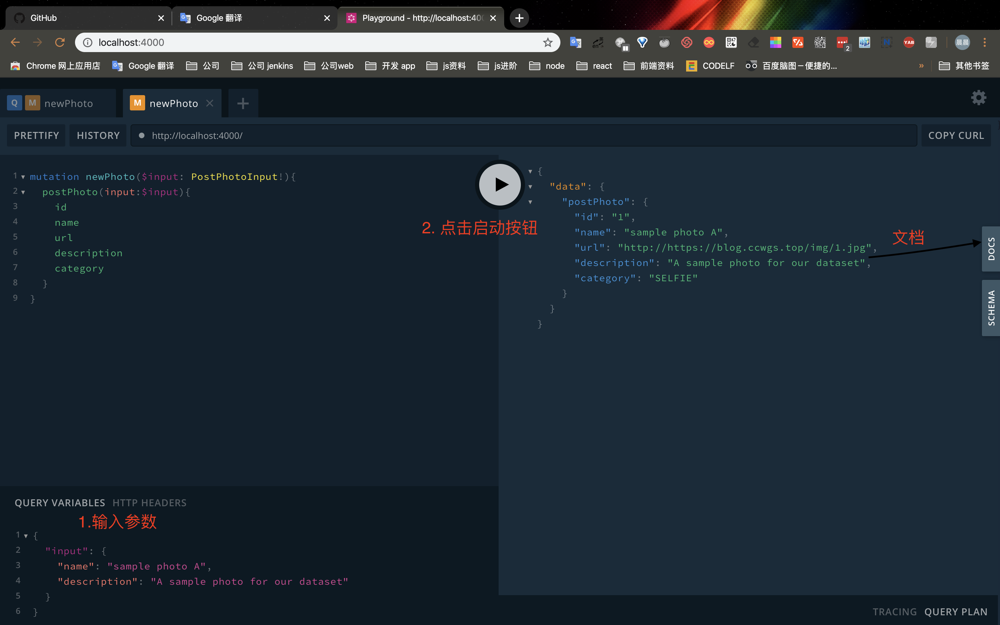

# 语法

# 搭建 Server API 环境
> npm i apollo-server graphql graphql-import graphql-tools mongoose 
> npm i typescript ts-node-dev -D

`package.json`

```js
  "scripts": {
    "start": "ts-node-dev --respawn --transpileOnly ./src/demo/index.ts"
  }
```

```js
import {ApolloServer} from 'apollo-server'

const typeDefs=`
    enum PhotoCategory {
        SELFIE
        PORTRAIT
        ACTION
        LANDSCAPE
        GRAPHIC
    }

    type Photo {
        id: ID!
        url: String!
        name: String!
        description: String
        category: PhotoCategory!
    }

    type Query{
        totalPhotos:Int!
        allPhotos: [Photo!]!
    }

    input PostPhotoInput {
        name: String!
        category: PhotoCategory=SELFIE
        description: String
    }

    type Mutation {
        postPhoto(input: PostPhotoInput!):Photo!
    }
`;
//_id 模拟数据自增ID
let _id=0;
const photos=[];

const resolvers={
    Photo:{
        url:parent=>`http://https://blog.ccwgs.top/img/${parent.id}.jpg`
    },
    Query:{
        totalPhotos:()=>photos.length,
        allPhotos:()=>photos
    },
    Mutation:{
        postPhoto(_,args){
            const newPhoto={
                id:_id++,
                ...args.input
            };
            photos.push(newPhoto);
            return newPhoto;
        }
    }
}
const server=new ApolloServer({
    typeDefs,
    resolvers
});

//开启服务监听 默认4000端口
server
    .listen()
    .then(({url})=>console.log(`GraphQL Service running on ${url}`))

```
> npm start
> 打开 连接 http://localhost:4000



# 参考
[intro-to-graphql](https://slides.com/scotups/intro-to-graphql#/)
[grapQL](https://graphql.cn/learn/)