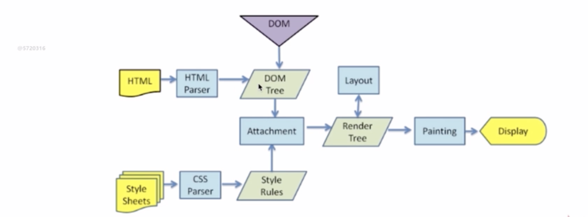

# 浏览器渲染
## 什么DOCTYPE及作用
使用来声明文档类型和规范,告诉浏览器是什么文档类型。
html5写法
<!DOCTYPE html>
html4.01有两种 strict模式和loose模式
## 浏览器渲染过程

## 重排Reflow
DOM节点中各个元素都有自己的模型，这些都需要浏览器根据各种样式来计算结果将元素放到它该出现的位置。
### 触发器条件？
- 删除、添加、修改DOM节点时
- 移动DOM的位置
- 修改css样式
- 窗口发生变化或者滚动的时候
- 当修改网页的默认字体时

## Repaint
当盒子位置、大小以及属性发生变化，浏览器将照各自的特性重新绘制一遍。
### 触发条件?
- DOM改变
- CSS改变
# js 运行机制
[推荐原文](https://juejin.im/post/59e85eebf265da430d571f89)
