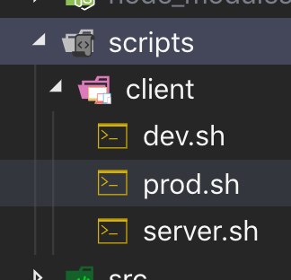

> 本目录主要是用 webpack 搭建 ts+react 开发环境

# 另一种管理脚本命令方法
下面介绍scripty库,该库可以让我们在package.json扩展自定义脚本，下面是上手指南,要详细了解点击➡️[scripty库文档](https://github.com/testdouble/scripty)
## 安装
> npm install scripty -D
## 使用步骤
1. 在项目根目录建立 scripts目录
2. 如果在package.json 定义如下形式 "client:dev"则需要在scripts/client 下建立 dev.sh
3. 声明 “client:dev” 到 package.json 中scripts字段中
package.json
```javascript
//其它省略 ...
 "scripts": {
    "test": "echo test ",
    "client:dev": "scripty",
    "client:pro": "scripty",
    "client:server": "scripty"
},
```

## 执行
```
#! ./scripts/client/dev.sh
echo hello,dev!
```
> npm run client:dev

提示：第一次运行命令时需要给scrips中文件赋权，执行如下命令即：
> chmod -R +x ./scripts

[仓库地址](https://github.com/cc7gs/frontEnd_note/tree/master/tools/webpack/ts-react-webpack)


# 待总结

- [ ] yargs-parser
- [ ] friendly-errors-webpack-plugin
- [ ] webpack-build-notifier


